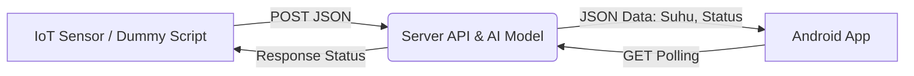

# 🐛 Green Maggot - Smart Biopond Ecosystem - AI System

**Solusi IoT & AI untuk Budidaya Maggot BSF Terintegrasi**

> Project MVP untuk Hackathon EISD 2025.


---

## 📖 Deskripsi

**Green Maggot** adalah sistem monitoring cerdas untuk kandang Maggot (Biopond). Sistem ini menggunakan AI (Isolation Forest) untuk mendeteksi anomali suhu/kelembaban secara real-time dan memberikan peringatan dini (Early Warning System) ke aplikasi Android.

Proyek ini terdiri dari 3 komponen utama:

1. **Server AI (Python/FastAPI)**: Otak yang memproses data dan memprediksi status.
2. **Dummy IoT (Python Script)**: Simulasi perangkat ESP32 yang mengirim data sensor.
3. **Mobile App (Android/Kotlin)**: Dashboard monitoring untuk pengguna.

---

## 🏗️ Arsitektur Sistem



---

## 🛠️ Tech Stack

- **Backend & AI**: Python, FastAPI, Scikit-Learn (Isolation Forest), Uvicorn
- **IoT Simulation**: Python Requests
- **Android App**: Kotlin, Retrofit2 (Networking), Gson

---

## 🚀 Cara Menjalankan (Installation Guide)

Ikuti langkah ini secara berurutan agar sistem berjalan lancar saat demo.

### 1. Persiapan Backend (Server AI)

Pastikan Python sudah terinstall.

```bash
# 1. Masuk ke folder backend
cd backend_server

# 2. Install library yang dibutuhkan
pip install fastapi uvicorn scikit-learn joblib numpy requests

# 3. Generate Model AI (Hanya sekali)
python bikin_model_cepat.py
# Output: Sukses membuat file 'my_existing_model.pkl'

# 4. Jalankan Server
python server_api.py
```

> **Note**: Server akan berjalan di `http://0.0.0.0:8000`. Jangan tutup terminal ini.

---

### 2. Menjalankan Simulasi IoT (Dummy Data)

Buka terminal baru (New Terminal). Script ini akan berpura-pura menjadi alat ESP32.

```bash
# Jalankan script simulasi
python dummy_iot.py
```

**Output**: Terminal akan menampilkan log pengiriman data suhu acak (Normal/Bahaya) setiap 2 detik.

---

### 3. Setup Android App (Kotlin)

1. Buka project di **Android Studio**.
2. **PENTING**: Cek IP Address Laptop kamu.
   - **Windows**: Buka CMD → ketik `ipconfig` → Cari **IPv4 Address**.
   - **Mac/Linux**: Terminal → `ifconfig`.
3. Buka file `MainActivity.kt`.
4. Ubah `baseUrl` pada konfigurasi Retrofit:

```kotlin
// GANTI '192.168.1.XX' dengan IP Laptop kamu yang sebenarnya!
// Jangan pakai 'localhost' karena Emulator/HP adalah device berbeda.
.baseUrl("http://192.168.1.10:8000/") 
```

5. Pastikan HP Android/Emulator terhubung ke **WiFi yang sama** dengan laptop.
6. **Run** aplikasi.

---

## 📡 API Documentation

### 1. Push Sensor Data (Untuk IoT)

**Endpoint**: `POST /push-sensor`

**Body (JSON)**:
```json
{
    "suhu": 38.5,
    "kelembaban": 60.0
}
```

---

### 2. Get Latest Status (Untuk Android)

**Endpoint**: `GET /get-latest`

**Response (JSON)**:
```json
{
    "suhu": 38.5,
    "kelembaban": 60.0,
    "status": "BAHAYA",
    "pesan": "🚨 SUHU KRITIS! Kipas Nyala Max."
}
```

> **Status Values**: `AMAN` | `WASPADA` | `BAHAYA`

---

## 🎨 Logika Status (3 Kategori)

Aplikasi Android akan berubah warna berdasarkan respons status dari server:

| Status | Logika Server | Warna UI Android | Arti |
|--------|---------------|------------------|------|
| **AMAN** | AI Prediksi Normal | 🟢 HIJAU | Kondisi Ideal |
| **WASPADA** | Anomali Ringan (36-38°C) | 🟡 KUNING | Cek kondisi |
| **BAHAYA** | Anomali Berat (>38°C) | 🔴 MERAH | Kipas Otomatis Nyala |

---

## 🐛 Troubleshooting (Masalah Umum)

### Q: Aplikasi Android tidak bisa connect (Connection Refused)?

**A**: 
- Pastikan Laptop dan HP di **WiFi yang sama**.
- Pastikan **Firewall laptop dimatikan** sementara atau allow port 8000.
- Pastikan IP di `MainActivity.kt` sudah benar (bukan `localhost`).

---

### Q: Server error "FileNotFound"?

**A**: 
- Pastikan file `my_existing_model.pkl` ada di folder yang sama dengan `server_api.py`.
- Jalankan `bikin_model_cepat.py` dulu jika hilang.

---

### Q: Data di Android tidak berubah?

**A**: 
- Pastikan script `dummy_iot.py` sedang berjalan dan berhasil mengirim data (lihat log terminalnya).

---

## 👥 Tim Green Maggot

- **Hacker/Tech**: [Genta Halilintar]
- **Hustler+AI**: [Nauval Yusriya Athalla]
- **Hipster/Design**: [Gregorius Edgar Dessaratu]

---

## 📝 License

Project ini dibuat untuk keperluan Hackathon Innovillage / EISD 2025.

---
